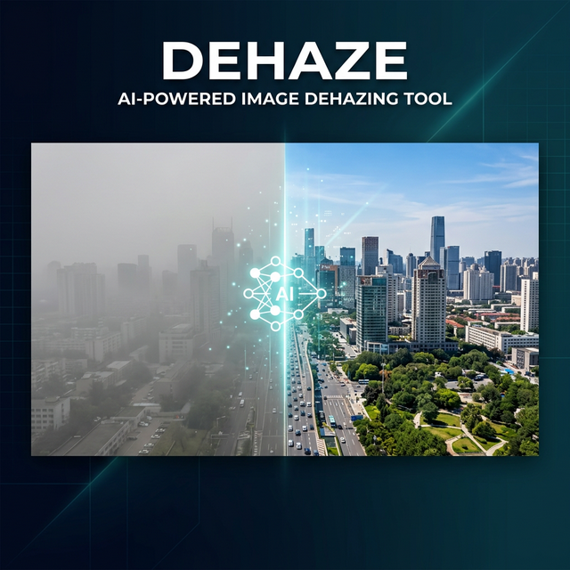

<p align="center">
  
</p>

<h1 align="center">🌫️ Dehaze — AI-Powered Image Dehazing</h1>

<p align="center">
  <b>Remove haze from outdoor images using deep learning with a full-stack web application</b>
</p>

<p align="center">
  
  
  
  
  
</p>

<p align="center">
  <a href="#-features">Features</a> •
  <a href="#-architecture">Architecture</a> •
  <a href="#-demo">Demo</a> •
  <a href="#-quick-start">Quick Start</a> •
  <a href="#-model-details">Model</a> •
  <a href="#-api-reference">API</a> •
  <a href="#-metrics">Metrics</a>
</p>

---

## ✨ Features

| Feature | Description |
|---------|-------------|
| 🧠 **MAXIM-S2 Backbone** | State-of-the-art Google MAXIM model pre-trained on SOTS outdoor dataset |
| 🔌 **Trainable Adapter** | Lightweight adapter head (~11K params) for fine-tuning without overfitting |
| 🖼️ **Tiled Inference** | High-resolution image support via automatic tiling — no resolution limits |
| 📊 **Quality Metrics** | Built-in PSNR, SSIM, and MSE computation with ground truth comparison |
| 🌐 **Full-Stack App** | React frontend + FastAPI backend with drag-and-drop image upload |
| ⚡ **GPU Accelerated** | XLA compilation and mixed precision (FP16) support for NVIDIA GPUs |
| 🔄 **Residual Learning** | Adapter learns residual corrections on top of backbone predictions |

---

## 🏗️ Architecture

```
┌──────────────────────────────────────────────────────────────┐
│                     DEHAZE SYSTEM                            │
├──────────────┬───────────────────────────┬───────────────────┤
│              │                           │                   │
│   Frontend   │       Backend API         │   ML Pipeline     │
│   (React)    │       (FastAPI)           │   (TensorFlow)    │
│              │                           │                   │
│  ┌────────┐  │  ┌──────────────────┐     │  ┌─────────────┐  │
│  │Upload  │──┼──│ POST /api/dehaze │─────┼──│ MAXIM-S2    │  │
│  │Preview │  │  │ POST /api/metrics│     │  │ (Frozen)    │  │
│  │Metrics │  │  │ GET  /api/health │     │  │     ↓       │  │
│  └────────┘  │  └──────────────────┘     │  │ Adapter Head│  │
│              │                           │  │ (Trainable) │  │
│              │                           │  └─────────────┘  │
└──────────────┴───────────────────────────┴───────────────────┘
```

### Model Pipeline

```
Input Hazy Image (any resolution)
         ↓
   ┌─────────────────────────────┐
   │  Tiled Inference Engine     │  ← Splits into 256×256 tiles
   └─────────────────────────────┘
         ↓ (per tile)
   ┌─────────────────────────────┐
   │  MAXIM-S2 Backbone          │  ← Pre-trained, FROZEN (~2.7M params)
   │  Multi-scale encoder-decoder│
   └─────────────────────────────┘
         ↓
   ┌─────────────────────────────┐
   │  Adapter Head               │  ← Fine-tuned (~11K params)
   │  Conv2D(32) → Conv2D(32)   │
   │  → Conv2D(3) + Residual    │
   └─────────────────────────────┘
         ↓
   Final = Backbone + Adapter Δ
   Clipped to [0, 1]
```

---

## 🎬 Demo

### How It Works

1. **Upload** a hazy image through the web interface
2. **Process** — the AI model removes haze while preserving details
3. **Compare** — view side-by-side results with quality metrics

---

## 🚀 Quick Start

### Prerequisites

- Python 3.8+
- Node.js 16+
- NVIDIA GPU (recommended) or CPU

### 1. Clone the Repository

```bash
git clone https://github.com/arnav-glitch/Dehaze.git
cd Dehaze
```

### 2. Set Up Backend

```bash
# Create virtual environment
cd backend
python -m venv venv

# Activate (Windows)
venv\Scripts\activate
# Activate (Linux/Mac)
# source venv/bin/activate

# Install dependencies
pip install -r requirements.txt

# Copy environment config
cp .env.example .env

# Start the API server
python app.py
```

The API will be running at `http://localhost:5000`.

### 3. Set Up Frontend

```bash
# Open a new terminal
cd frontend

# Install dependencies
npm install

# Start the development server
npm start
```

The app will be running at `http://localhost:3000`.

### 4. Download the Pre-trained Model

The MAXIM-S2 backbone model (~100MB) is automatically downloaded from Hugging Face on first run. Alternatively, place it manually:

```
Dehaze/
└── maxim_savedmodel/
    ├── saved_model.pb
    ├── keras_metadata.pb
    └── variables/
```

### 5. Training Data (Optional)

If you want to retrain or fine-tune, organize your data as:

```
data/
├── train/
│   ├── input/    # Hazy images (JPG/PNG)
│   └── target/   # Clean reference images (PNG)
└── val/
    ├── input/    # Validation hazy images
    └── target/   # Validation clean images
```

---

## 🧠 Model Details

### Base Model

| Property | Value |
|----------|-------|
| **Model** | MAXIM-S2 (Multi-scale Arbitrary Mixing) |
| **Source** | `google/maxim-s2-dehazing-sots-outdoor` |
| **Parameters** | ~2.7 million (frozen) |
| **Pre-training** | SOTS outdoor dehazing benchmark |
| **Format** | TensorFlow SavedModel |

### Adapter Head

| Property | Value |
|----------|-------|
| **Architecture** | 3× Conv2D layers with residual connection |
| **Parameters** | ~11,043 (trainable) |
| **Initialization** | Zero-init (safe fallback to base model) |
| **Output** | Residual correction (Final = Base + Δ) |

### Training Configuration

| Hyperparameter | Value |
|----------------|-------|
| Epochs | 5–10 |
| Batch Size | 8 |
| Learning Rate | 2e-4 (Adam) |
| Image Size | 256×256 |
| Loss Function | L1 + 0.2 × (1 − SSIM) |
| Augmentation | Random H/V flips |
| Dataset | 413 image pairs (train & val) |

### Loss Function

```
Loss = L1(pred, target) + 0.2 × (1 - SSIM(pred, target))
```

- **L1 Loss** — pixel-wise reconstruction accuracy
- **SSIM Loss** — structural similarity preservation

---

## 📡 API Reference

### Endpoints

| Method | Endpoint | Description |
|--------|----------|-------------|
| `GET` | `/api/health` | Health check & model status |
| `POST` | `/api/dehaze` | Dehaze a single image |
| `POST` | `/api/dehaze-with-metrics` | Dehaze + compute quality metrics |
| `GET` | `/api/info` | API version and endpoint info |

### `POST /api/dehaze`

**Request:** `multipart/form-data` with field `file` (image)

**Response:**
```json
{
  "success": true,
  "dehazed_image": "data:image/jpeg;base64,...",
  "processing_time_ms": 1234.56,
  "input_size": [800, 600],
  "output_size": [800, 600]
}
```

### `POST /api/dehaze-with-metrics`

**Request:** `multipart/form-data` with fields `hazy_image` and optional `ground_truth`

**Response:**
```json
{
  "success": true,
  "dehazed_image": "data:image/jpeg;base64,...",
  "processing_time_ms": 1567.89,
  "has_ground_truth": true,
  "metrics": {
    "psnr": { "hazy_vs_dehazed": 22.45, "dehazed_vs_ground_truth": 28.12 },
    "ssim": { "hazy_vs_dehazed": 0.8234, "dehazed_vs_ground_truth": 0.9156 },
    "mse":  { "hazy_vs_dehazed": 370.12, "dehazed_vs_ground_truth": 100.45 }
  }
}
```

---

## 📊 Metrics

The system computes three image quality metrics:

| Metric | Range | Ideal | Description |
|--------|-------|-------|-------------|
| **PSNR** | 0–∞ dB | Higher is better (>30 dB is good) | Peak Signal-to-Noise Ratio |
| **SSIM** | −1 to 1 | Closer to 1 is better | Structural Similarity Index |
| **MSE** | 0–∞ | Lower is better | Mean Squared Error |

---

## 📁 Project Structure

```
Dehaze/
├── 📂 assets/                        # Repository assets (banner, etc.)
├── 📂 backend/                       # FastAPI backend server
│   ├── app.py                       # Main API server (FastAPI + Uvicorn)
│   ├── inference.py                 # Model loading & inference pipeline
│   ├── metrics.py                   # PSNR, SSIM, MSE computation
│   ├── config.py                    # Environment configuration
│   ├── logger.py                    # Logging utilities
│   ├── requirements.txt            # Python dependencies
│   ├── .env.example                # Environment template
│   ├── test_inference.py           # Inference unit tests
│   ├── test_metrics.py             # Metrics unit tests
│   └── test_tiling.py              # Tiled inference tests
├── 📂 frontend/                      # React web application
│   ├── src/
│   │   ├── App.jsx                  # Main application component
│   │   ├── components/
│   │   │   ├── ImageUpload.jsx      # Drag-and-drop upload
│   │   │   └── ImagePreview.jsx     # Side-by-side comparison
│   │   ├── services/
│   │   │   └── api.js               # API client
│   │   └── styles/
│   │       ├── main.css             # Global styles
│   │       └── components.css       # Component styles
│   └── package.json
├── 📓 dehaze_14Dec_1.ipynb           # Primary training notebook
├── 📓 dehaze_gpu.ipynb               # GPU-optimized training notebook
├── 📓 GPU_dehaze.ipynb               # GPU verification notebook
├── 🏋️ adapter_best.weights.h5       # Trained adapter weights (best checkpoint)
├── 📂 maxim_savedmodel/              # Pre-trained MAXIM-S2 backbone (~100MB)
├── 📂 data/                          # Training & validation datasets
│   ├── train/ (input/ + target/)    # 413 image pairs
│   └── val/   (input/ + target/)    # 413 image pairs
└── README.md
```

---

## 🔧 Tech Stack

<table>
  <tr>
    <td align="center"><b>Category</b></td>
    <td align="center"><b>Technology</b></td>
  </tr>
  <tr>
    <td>🧠 Deep Learning</td>
    <td>TensorFlow 2.18+, Keras</td>
  </tr>
  <tr>
    <td>🤖 Base Model</td>
    <td>Google MAXIM-S2 (Hugging Face)</td>
  </tr>
  <tr>
    <td>⚙️ Backend</td>
    <td>FastAPI, Uvicorn, Python</td>
  </tr>
  <tr>
    <td>🖥️ Frontend</td>
    <td>React 18, JavaScript</td>
  </tr>
  <tr>
    <td>📊 Metrics</td>
    <td>scikit-image (PSNR, SSIM)</td>
  </tr>
  <tr>
    <td>🖼️ Image Processing</td>
    <td>Pillow, NumPy</td>
  </tr>
  <tr>
    <td>🏋️ Training</td>
    <td>Jupyter Notebooks, Custom TF loop</td>
  </tr>
</table>

---

## 📝 Training Notebooks

| Notebook | Purpose | Epochs | GPU Optimizations |
|----------|---------|--------|-------------------|
| `dehaze_14Dec_1.ipynb` | Primary training | 5 | — |
| `dehaze_gpu.ipynb` | GPU-optimized training | 10 | XLA, Mixed Precision (FP16) |
| `GPU_dehaze.ipynb` | GPU setup verification | — | CUDA check |

---

## 🤝 Contributing

Contributions are welcome! Feel free to:

1. Fork the repository
2. Create a feature branch (`git checkout -b feature/amazing-feature`)
3. Commit your changes (`git commit -m 'Add amazing feature'`)
4. Push to the branch (`git push origin feature/amazing-feature`)
5. Open a Pull Request

---

## 📜 References

- **MAXIM** — [Multi-Axis MLP Mixer for Image Processing](https://arxiv.org/abs/2201.02973) (Google Research)
- **SOTS Dataset** — Synthetic Objective Testing Set for outdoor dehazing
- **Hugging Face** — [google/maxim-s2-dehazing-sots-outdoor](https://huggingface.co/google/maxim-s2-dehazing-sots-outdoor)

---

## 📄 License

This project is licensed under the MIT License — see the [LICENSE](LICENSE) file for details.

---

<p align="center">
  Made with ❤️ by <a href="https://github.com/arnav-glitch">Arnav</a>
</p>